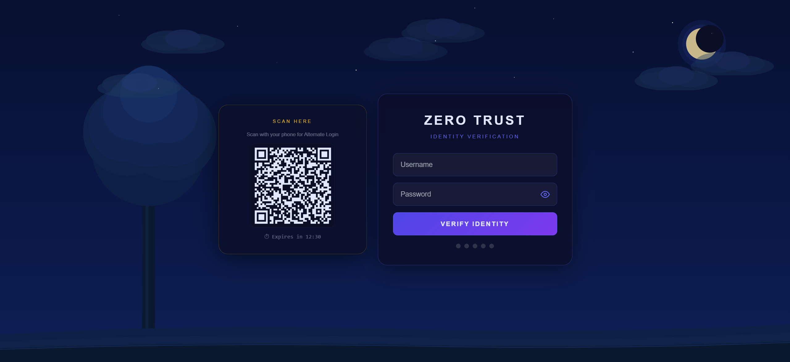
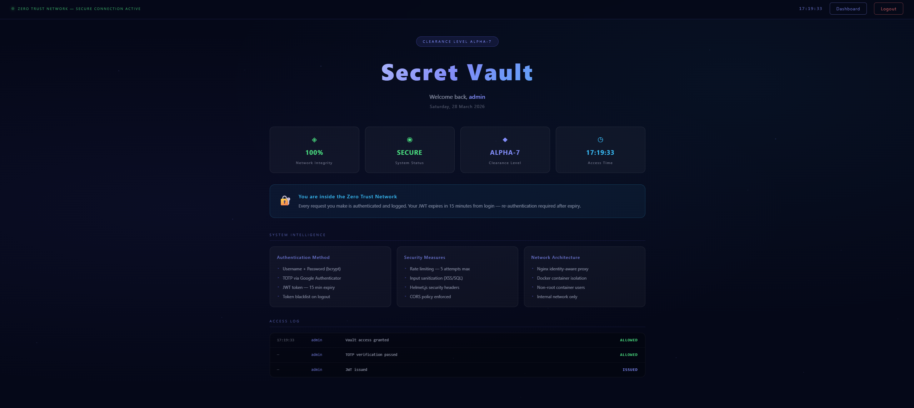
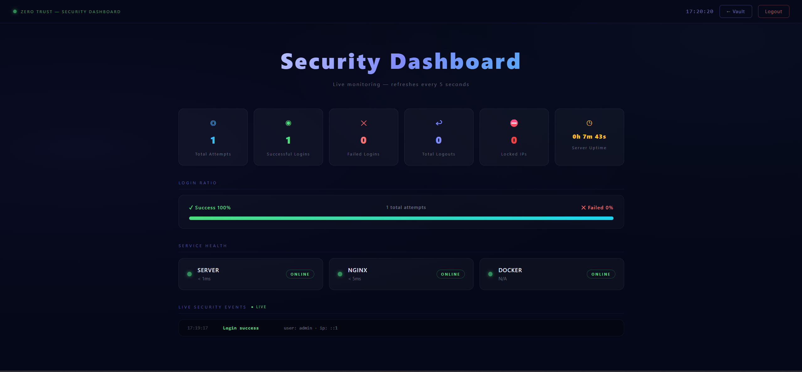
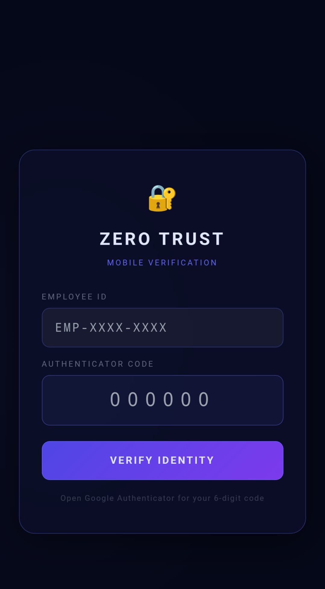

# Zero Trust Network Security

A full-stack Zero Trust Network simulation built with React, Node.js, Docker, and Nginx. Every request must carry proof of identity — no token, no access.

**Live Demo:** [zero-trust-network-xi.vercel.app](https://zero-trust-network-xi.vercel.app)

---

## Screenshots

### Login Page



### Secret Vault



### Security Dashboard



### Alternate Login — Mobile Verification



---

## What Is Zero Trust?

Zero Trust means nobody gets access to anything without proving identity at every single step. Even after login, every request is re-verified. No token means instant rejection — not even the backend server is directly reachable from outside.

---

## Features

- **Animated login page** — night scene illustration with moving clouds, blinking stars, and a crescent moon
- **Multi-factor authentication** — Username + Password (bcrypt) + TOTP via Google Authenticator
- **JWT tokens** — issued on successful login, expire after 15 minutes, blacklisted on logout
- **Out-of-Band (OOB) Authentication via QR code** — an enterprise security pattern used by Okta, Microsoft, and Duo. Scan the QR code with your phone, verify your Employee ID + TOTP on the phone itself, and the PC session automatically unlocks and redirects to the vault — no password typed on the PC
- **Rate limiting** — 5 failed attempts triggers a timed lockout per IP, up to 3 rounds before permanent lock requiring administrator intervention
- **Token blacklist** — logged-out tokens are invalidated server-side and cannot be reused even before expiry
- **Input sanitization** — XSS and injection protection on all inputs via express-validator
- **Nginx identity-aware proxy** — all requests pass through Nginx first, JWT required on every protected route, backend not directly reachable
- **Docker container isolation** — each service runs in its own container on a private internal network, backend port not exposed externally
- **Security dashboard** — live login stats, failed attempt tracking, locked IP count, server uptime, service health monitoring — refreshes every 5 seconds
- **bcrypt password hashing** — passwords never stored in plain text, salted with cost factor 12
- **Helmet.js** — secure HTTP headers on every response
- **Scope-aware JWT middleware** — tokens carry scope claims, guest tokens are rejected from admin-only endpoints even if valid

---

## Tech Stack

| Layer            | Technology                      |
| ---------------- | ------------------------------- |
| Frontend         | React + Vite + CSS-in-JS        |
| Backend          | Node.js + Express               |
| Authentication   | JWT + bcrypt + speakeasy (TOTP) |
| Rate Limiting    | express-rate-limit              |
| Security Headers | Helmet.js                       |
| Input Validation | express-validator               |
| Proxy            | Nginx (Docker)                  |
| Containers       | Docker + Docker Compose         |
| QR Code          | qrcode + uuid                   |
| Frontend Deploy  | Vercel                          |
| Backend Deploy   | Render                          |

---

## Authentication Flow

```
User → POST /api/auth/login
         ↓
    Rate limiter (5 attempts max per IP)
         ↓
    Input sanitization (XSS/injection protection)
         ↓
    bcrypt password verify
         ↓
    TOTP code verify (Google Authenticator)
         ↓
    JWT issued (15 min expiry)
         ↓
    Nginx proxy validates JWT on every subsequent request
         ↓
    Secret Vault unlocked
```

---

## Out-of-Band (OOB) Authentication — QR Code Flow

This is an enterprise security pattern where a secondary trusted device (phone) authenticates to grant access to a primary device (PC). The same approach is used by Microsoft Authenticator, Okta Verify, and Duo Security.

```
PC displays QR code on login page (refreshes every 15 min)
         ↓
Phone scans QR → opens mobile verification page
         ↓
Phone enters Employee ID + 6-digit TOTP code
         ↓
Server verifies Employee ID maps to a valid account
         ↓
Server verifies TOTP code via speakeasy
         ↓
Server issues full JWT, stores it against the session tokenId
         ↓
PC polls server every 3 seconds via /api/auth/check-scan/:tokenId
         ↓
PC detects scan → receives JWT → saves to localStorage → redirects to vault
         ↓
Phone shows "Access Granted — PC is loading vault"
```

No password is ever typed on the PC. The phone acts as the trusted authenticator device.

---

## Security Cases Handled

| Case                     | Behaviour                                                |
| ------------------------ | -------------------------------------------------------- |
| No token                 | 401 Unauthorized — blocked by Nginx proxy                |
| Wrong credentials        | "Invalid credentials" — never reveals which field failed |
| Wrong Employee ID        | 401 — same generic message, no enumeration               |
| 5 failed attempts        | IP locked out for 60 seconds                             |
| 3 lockout rounds         | Permanent lock — contact administrator                   |
| Expired JWT              | 401 Token Expired — must re-authenticate                 |
| Logged-out token         | Blacklisted server-side — cannot be reused               |
| Guest token on dashboard | 403 Insufficient Scope — blocked by middleware           |
| Tampered JWT             | 401 Invalid Token — signature verification fails         |

---

## Project Structure

```
zero-trust-network/
├── client/                    ← React + Vite frontend
│   ├── src/
│   │   ├── components/
│   │   │   └── SamuraiLogin/  ← Login page + QR panel
│   │   ├── pages/
│   │   │   ├── Login.jsx
│   │   │   ├── Vault.jsx      ← Protected vault page
│   │   │   ├── Dashboard.jsx  ← Security monitoring panel
│   │   │   └── GuestVault.jsx ← Mobile OOB verification page
│   │   └── services/
│   │       └── api.js         ← Axios API calls
│   └── vercel.json
├── server/                    ← Node.js + Express backend
│   ├── routes/
│   │   ├── auth.js            ← Login, logout, TOTP, QR, phone-verify
│   │   ├── vault.js           ← Protected vault endpoint
│   │   └── dashboard.js       ← Security stats endpoint
│   ├── middleware/
│   │   ├── verifyToken.js     ← JWT verification + scope checking
│   │   ├── rateLimiter.js     ← Brute force protection
│   │   └── sanitize.js        ← Input sanitization
│   └── services/
│       ├── tokenBlacklist.js  ← Invalidated token storage
│       ├── totp.js            ← Google Authenticator logic
│       └── stats.js           ← Login stats + QR session tracking
├── proxy/
│   └── nginx.conf             ← Identity-aware proxy config
├── docker/
│   ├── Dockerfile.server
│   └── Dockerfile.proxy
├── docker-compose.yml
└── screenshots/
```

---

## Running Locally

**Prerequisites:** Node.js 22+, Docker Desktop

**Backend:**

```bash
cd server
npm install
node index.js
```

**Frontend:**

```bash
cd client
npm install
npm run dev
```

**With Docker (Nginx proxy simulation):**

```bash
docker compose up --build
```

**Default credentials:**

- Username: `admin`
- Password: `ZeroTrust@2026`
- TOTP: Google Authenticator (configured via TOTP_SECRET in .env)
- Employee ID (OOB login): `EMP-2026-ADMIN`

---

## Environment Variables

**server/.env**

```
PORT=3001
JWT_SECRET=your_64_char_random_secret
TOTP_SECRET=your_base32_totp_secret
NODE_ENV=development
CLIENT_URL=http://localhost:5173
EMPLOYEE_ID=EMP-2026-ADMIN
```

**client/.env**

```
VITE_API_URL=http://localhost:3001/api
```

---

## Deployment

| Service  | Platform | URL                              |
| -------- | -------- | -------------------------------- |
| Frontend | Vercel   | zero-trust-network-xi.vercel.app |
| Backend  | Render   | zero-trust-network.onrender.com  |

Vercel handles SSL and CDN automatically. Render provisions HTTPS on the free tier. Both platforms auto-deploy on every push to the main GitHub branch.

---

## Security Notes

- The `server/.env` file is in `.gitignore` and never committed — all secrets are injected via platform environment variables on Render
- CORS is locked to the Vercel domain in production — arbitrary origins are rejected
- The Nginx proxy sits in front of the Express server — the Node.js port is never exposed externally in Docker
- Rate limiting runs at the application layer (Express) before requests reach any business logic

---

## Built By

Hrishikeesh — portfolio project demonstrating real-world Zero Trust security concepts including MFA, JWT, Docker isolation, identity-aware proxying, and Out-of-Band device authentication.
